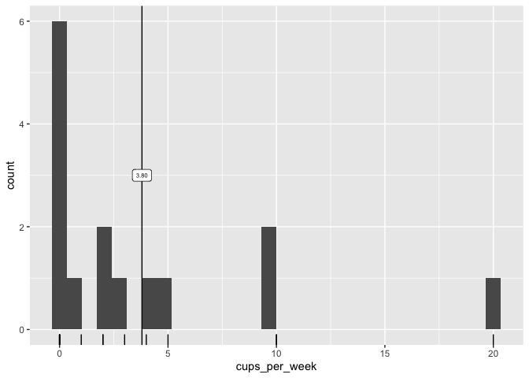
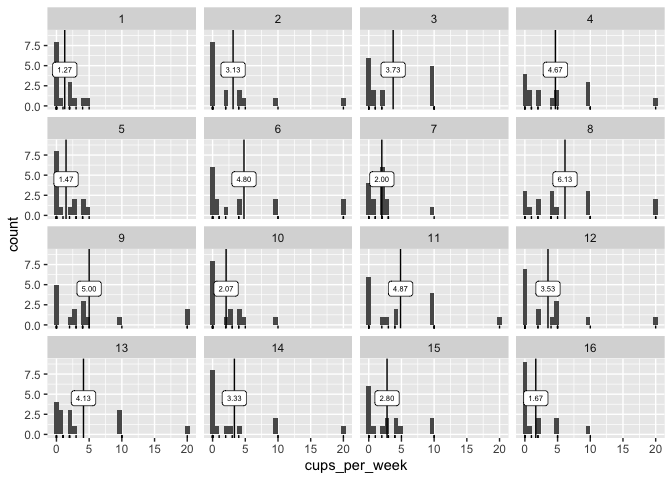
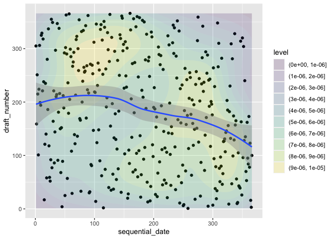
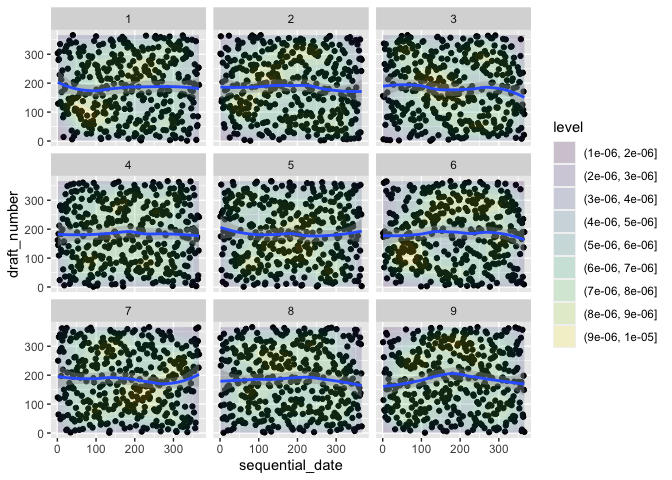

<!-- README.md is generated from README.Rmd. Please edit that file -->

# ma206data

<!-- badges: start -->

<!-- badges: end -->

The goal of ma206data is to make the Introduction to Statistical
Investigations, Edition II datasets quickly accessible in R.

``` r
remotes::install_github("EvaMaeRey/ma206data")
```

## Here are some datasets made easily available and ready to explore\!

``` r
library(tidyverse)
#> ── Attaching packages ─────────────────────────────────────── tidyverse 1.3.0 ──
#> ✓ ggplot2 3.3.5     ✓ purrr   0.3.4
#> ✓ tibble  3.1.6     ✓ dplyr   1.0.8
#> ✓ tidyr   1.0.2     ✓ stringr 1.4.0
#> ✓ readr   1.3.1     ✓ forcats 0.5.0
#> Warning: package 'ggplot2' was built under R version 3.6.2
#> Warning: package 'tibble' was built under R version 3.6.2
#> Warning: package 'purrr' was built under R version 3.6.2
#> Warning: package 'dplyr' was built under R version 3.6.2
#> ── Conflicts ────────────────────────────────────────── tidyverse_conflicts() ──
#> x dplyr::filter() masks stats::filter()
#> x dplyr::lag()    masks stats::lag()
library(ma206data)
## basic example code

chap2_Coffee # bam chapter 2 coffee data in your workstation - rock and roll
#> # A tibble: 15 × 1
#>    cups_per_week
#>            <dbl>
#>  1             0
#>  2             5
#>  3             0
#>  4             0
#>  5             2
#>  6            10
#>  7             0
#>  8             4
#>  9             3
#> 10             0
#> 11             1
#> 12            10
#> 13             2
#> 14            20
#> 15             0

chap2_Coffee %>% 
  ggplot() +
  aes(cups_per_week) + 
  geom_rug() + 
  geom_histogram() + 
  ggxmean::geom_x_mean() + 
  ggxmean::geom_x_mean_label(size = 2)
#> `stat_bin()` using `bins = 30`. Pick better value with `binwidth`.
```



``` r

last_plot() + 
  ggsample::facet_bootstrap(n_facets = 16) 
#> `stat_bin()` using `bins = 30`. Pick better value with `binwidth`.
```



``` r

chap10_DraftLottery %>% 
  data.frame() %>% 
  ggplot() + 
  aes(x = sequential_date,
      y = draft_number) + 
  geom_point() + 
  geom_density2d_filled(alpha = .2) + 
  geom_smooth()
#> `geom_smooth()` using method = 'loess' and formula 'y ~ x'
```



``` r

last_plot() + 
  ggsample::facet_scramble()
#> `geom_smooth()` using method = 'loess' and formula 'y ~ x'
```



# We managed the project by doing the following

## ISI data

  - scraping <http://www.isi-stats.com/isi2nd/data.html> for .txt files,
    saving them in “isi\_txt\_data”
  - reading those files into r
  - saving an .rda file

This was accomplished in “./data-raw/scrape\_and\_prep\_isi\_ed2.R”. We
quote the code here:

``` r
## code to prepare `DATASET` dataset goes here
#
# AP.BottledWater = readr::read_csv("data-raw/AP.BottledWater.csv")
#
# usethis::use_data(AP.BottledWater, overwrite = TRUE)

####################################################################


library(tidyverse)
# look at text of html file
readLines("http://www.isi-stats.com/isi2nd/data.html") %>%
  # each line is content in data frame
  tibble(text = .) %>%
  filter(str_detect(text, "\\.txt")) %>%
  mutate(href =
           str_extract(text, "http.+\\.txt"),
         .before = 1) %>%
  mutate(dataset_name = str_extract(href, "data.+"),
         .before = 1) %>%
  mutate(dataset_name =
           str_remove(dataset_name, "data."),
         .before = 1) %>%
  mutate(dataset_name =
           str_remove(dataset_name, "\\.txt")) %>%
  mutate(dataset_name =
           str_replace(dataset_name, "\\/", "_")) ->
  href_df

href_df$dataset_name


## Download raw data .txt files in isi folder in data-raw
isi_dir <- "data-raw/isi_txt_data/"
dir.create(isi_dir)

for (i in 1:length(href_df$href)){

  Sys.sleep(time = 1)
  try(
  download.file(url = href_df$href[i],
                destfile = paste0(isi_dir, href_df$dataset_name[i], ".txt"))
  )
}

# clean a bit and convert to .rda files, send to package data folder

isi_file_paths <- fs::dir_ls("data-raw/isi_txt_data/")
length(isi_file_paths)

dataset_name <- isi_file_paths %>%
  str_remove("data-raw/isi_txt_data/") %>%
  str_remove(".txt$")

## a list that populates with datasets
isi_datasets <- list()


for (i in 1:length(isi_file_paths)){


  # pause so you don't hit isi website too often
  Sys.sleep(time = .2)

  # attempt to harvest data
  tryCatch(

    isi_file_paths[i] %>%
      readr::read_delim(delim = "\t") %>%
      janitor::clean_names() ->
    isi_datasets[[i]]

  )

  assign(x = dataset_name[i], value = isi_datasets[[i]])

  save(list = dataset_name[i],
       file = paste0("data/", dataset_name[i], ".rda"))

  }
```

## Additional data from course director

  - we manually copied in additional data files used in the course into
    “data-raw/course\_director\_data”
  - read the files into R
  - saved rda files into the data folder

This is accomplished in the script,
“./data-raw/prep\_course\_director\_data.R”, and the code is shown
here:

``` r


library(tidyverse)
# look at text of html file

# csvs were
fs::dir_ls(path = "data-raw/course_director_data/") ->
  course_director_csvs

# clean a bit and convert to .rda files, send to package data folder


dataset_name <- course_director_csvs %>%
  str_remove("data-raw/course_director_data/") %>%
  str_remove(".csv$")

## a list that populates with datasets
course_director_datasets <- list()


for (i in 1:length(course_director_csvs)){


  # attempt to read in data
  tryCatch(

    course_director_csvs[i] %>%
      readr::read_csv() %>%
      janitor::clean_names() ->
    course_director_datasets[[i]]

  )

  # assignment without assignment operator
  assign(x = dataset_name[i], value = course_director_datasets[[i]])

  #
  save(list = dataset_name[i],
       file = paste0("data/", "cd_", dataset_name[i], ".rda"))

  }
```

# Documentation

Finally, we coordinated minimal documentation in
“./data-raw/write\_dataset\_minimal\_documentation.R”

The code is quoted here:

``` r


# Write 'docs' (minimal possible)

list.files(path = "data") %>%
  str_remove(".rda$") %>%
  paste0("'", .,"'") %>%
  writeLines("R/datasets_listed.R")
```
